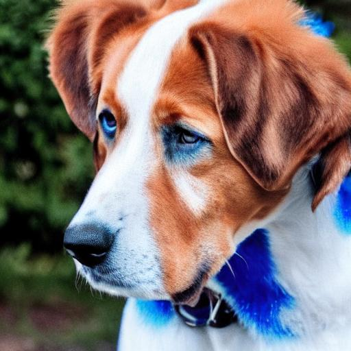
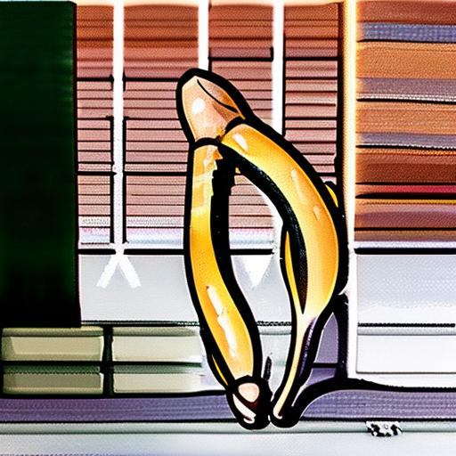
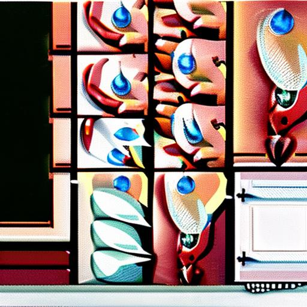

# Results
Category "Colors" in the benchmark: 

<table class="center">
	<tr><td style="text-align:center;", colspan="3"><b>1:A red colored car.</b></td></tr>
	<tr>
		<td></td>
		<td></td>
		<td></td>
	</tr><tr>
		<td width=33% style="text-align:center;">CompVis-stable-diffusion-v1-4</td>
		<td width=33% style="text-align:center;">runwayml-stable-diffusion-v1-5</td>
		<td width=33% style="text-align:center;">stabilityai-stable-diffusion-2-1</td>
	</tr>
	<tr><td style="text-align:center;", colspan="3"><b>2:A black colored car.</b></td></tr>
	<tr>
		<td></td>
		<td></td>
		<td></td>
	</tr><tr>
		<td width=33% style="text-align:center;">CompVis-stable-diffusion-v1-4</td>
		<td width=33% style="text-align:center;">runwayml-stable-diffusion-v1-5</td>
		<td width=33% style="text-align:center;">stabilityai-stable-diffusion-2-1</td>
	</tr>
	<tr><td style="text-align:center;", colspan="3"><b>3:A pink colored car.</b></td></tr>
	<tr>
		<td></td>
		<td></td>
		<td></td>
	</tr><tr>
		<td width=33% style="text-align:center;">CompVis-stable-diffusion-v1-4</td>
		<td width=33% style="text-align:center;">runwayml-stable-diffusion-v1-5</td>
		<td width=33% style="text-align:center;">stabilityai-stable-diffusion-2-1</td>
	</tr>
	<tr><td style="text-align:center;", colspan="3"><b>4:A black colored dog.</b></td></tr>
	<tr>
		<td></td>
		<td></td>
		<td></td>
	</tr><tr>
		<td width=33% style="text-align:center;">CompVis-stable-diffusion-v1-4</td>
		<td width=33% style="text-align:center;">runwayml-stable-diffusion-v1-5</td>
		<td width=33% style="text-align:center;">stabilityai-stable-diffusion-2-1</td>
	</tr>
	<tr><td style="text-align:center;", colspan="3"><b>5:A red colored dog.</b></td></tr>
	<tr>
		<td></td>
		<td></td>
		<td></td>
	</tr><tr>
		<td width=33% style="text-align:center;">CompVis-stable-diffusion-v1-4</td>
		<td width=33% style="text-align:center;">runwayml-stable-diffusion-v1-5</td>
		<td width=33% style="text-align:center;">stabilityai-stable-diffusion-2-1</td>
	</tr>
	<tr><td style="text-align:center;", colspan="3"><b>6:A blue colored dog.</b></td></tr>
	<tr>
		<td></td>
		<td></td>
		<td></td>
	</tr><tr>
		<td width=33% style="text-align:center;">CompVis-stable-diffusion-v1-4</td>
		<td width=33% style="text-align:center;">runwayml-stable-diffusion-v1-5</td>
		<td width=33% style="text-align:center;">stabilityai-stable-diffusion-2-1</td>
	</tr>
	<tr><td style="text-align:center;", colspan="3"><b>7:A green colored banana.</b></td></tr>
	<tr>
		<td></td>
		<td></td>
		<td></td>
	</tr><tr>
		<td width=33% style="text-align:center;">CompVis-stable-diffusion-v1-4</td>
		<td width=33% style="text-align:center;">runwayml-stable-diffusion-v1-5</td>
		<td width=33% style="text-align:center;">stabilityai-stable-diffusion-2-1</td>
	</tr>
	<tr><td style="text-align:center;", colspan="3"><b>8:A red colored banana.</b></td></tr>
	<tr>
		<td></td>
		<td></td>
		<td></td>
	</tr><tr>
		<td width=33% style="text-align:center;">CompVis-stable-diffusion-v1-4</td>
		<td width=33% style="text-align:center;">runwayml-stable-diffusion-v1-5</td>
		<td width=33% style="text-align:center;">stabilityai-stable-diffusion-2-1</td>
	</tr>
	<tr><td style="text-align:center;", colspan="3"><b>9:A black colored banana.</b></td></tr>
	<tr>
		<td></td>
		<td></td>
		<td></td>
	</tr><tr>
		<td width=33% style="text-align:center;">CompVis-stable-diffusion-v1-4</td>
		<td width=33% style="text-align:center;">runwayml-stable-diffusion-v1-5</td>
		<td width=33% style="text-align:center;">stabilityai-stable-diffusion-2-1</td>
	</tr>
	<tr><td style="text-align:center;", colspan="3"><b>10:A white colored sandwich.</b></td></tr>
	<tr>
		<td></td>
		<td></td>
		<td></td>
	</tr><tr>
		<td width=33% style="text-align:center;">CompVis-stable-diffusion-v1-4</td>
		<td width=33% style="text-align:center;">runwayml-stable-diffusion-v1-5</td>
		<td width=33% style="text-align:center;">stabilityai-stable-diffusion-2-1</td>
	</tr>
	<tr><td style="text-align:center;", colspan="3"><b>11:A black colored sandwich.</b></td></tr>
	<tr>
		<td></td>
		<td></td>
		<td></td>
	</tr><tr>
		<td width=33% style="text-align:center;">CompVis-stable-diffusion-v1-4</td>
		<td width=33% style="text-align:center;">runwayml-stable-diffusion-v1-5</td>
		<td width=33% style="text-align:center;">stabilityai-stable-diffusion-2-1</td>
	</tr>
	<tr><td style="text-align:center;", colspan="3"><b>12:An orange colored sandwich.</b></td></tr>
	<tr>
		<td></td>
		<td></td>
		<td></td>
	</tr><tr>
		<td width=33% style="text-align:center;">CompVis-stable-diffusion-v1-4</td>
		<td width=33% style="text-align:center;">runwayml-stable-diffusion-v1-5</td>
		<td width=33% style="text-align:center;">stabilityai-stable-diffusion-2-1</td>
	</tr>
	<tr><td style="text-align:center;", colspan="3"><b>13:A pink colored giraffe.</b></td></tr>
	<tr>
		<td></td>
		<td></td>
		<td></td>
	</tr><tr>
		<td width=33% style="text-align:center;">CompVis-stable-diffusion-v1-4</td>
		<td width=33% style="text-align:center;">runwayml-stable-diffusion-v1-5</td>
		<td width=33% style="text-align:center;">stabilityai-stable-diffusion-2-1</td>
	</tr>
	<tr><td style="text-align:center;", colspan="3"><b>14:A yellow colored giraffe.</b></td></tr>
	<tr>
		<td></td>
		<td></td>
		<td></td>
	</tr><tr>
		<td width=33% style="text-align:center;">CompVis-stable-diffusion-v1-4</td>
		<td width=33% style="text-align:center;">runwayml-stable-diffusion-v1-5</td>
		<td width=33% style="text-align:center;">stabilityai-stable-diffusion-2-1</td>
	</tr>
	<tr><td style="text-align:center;", colspan="3"><b>15:A brown colored giraffe.</b></td></tr>
	<tr>
		<td></td>
		<td></td>
		<td></td>
	</tr><tr>
		<td width=33% style="text-align:center;">CompVis-stable-diffusion-v1-4</td>
		<td width=33% style="text-align:center;">runwayml-stable-diffusion-v1-5</td>
		<td width=33% style="text-align:center;">stabilityai-stable-diffusion-2-1</td>
	</tr>
	<tr><td style="text-align:center;", colspan="3"><b>16:A red car and a white sheep.</b></td></tr>
	<tr>
		<td></td>
		<td></td>
		<td></td>
	</tr><tr>
		<td width=33% style="text-align:center;">CompVis-stable-diffusion-v1-4</td>
		<td width=33% style="text-align:center;">runwayml-stable-diffusion-v1-5</td>
		<td width=33% style="text-align:center;">stabilityai-stable-diffusion-2-1</td>
	</tr>
	<tr><td style="text-align:center;", colspan="3"><b>17:A blue bird and a brown bear.</b></td></tr>
	<tr>
		<td></td>
		<td></td>
		<td></td>
	</tr><tr>
		<td width=33% style="text-align:center;">CompVis-stable-diffusion-v1-4</td>
		<td width=33% style="text-align:center;">runwayml-stable-diffusion-v1-5</td>
		<td width=33% style="text-align:center;">stabilityai-stable-diffusion-2-1</td>
	</tr>
	<tr><td style="text-align:center;", colspan="3"><b>18:A green apple and a black backpack.</b></td></tr>
	<tr>
		<td></td>
		<td></td>
		<td></td>
	</tr><tr>
		<td width=33% style="text-align:center;">CompVis-stable-diffusion-v1-4</td>
		<td width=33% style="text-align:center;">runwayml-stable-diffusion-v1-5</td>
		<td width=33% style="text-align:center;">stabilityai-stable-diffusion-2-1</td>
	</tr>
	<tr><td style="text-align:center;", colspan="3"><b>19:A green cup and a blue cell phone.</b></td></tr>
	<tr>
		<td></td>
		<td></td>
		<td></td>
	</tr><tr>
		<td width=33% style="text-align:center;">CompVis-stable-diffusion-v1-4</td>
		<td width=33% style="text-align:center;">runwayml-stable-diffusion-v1-5</td>
		<td width=33% style="text-align:center;">stabilityai-stable-diffusion-2-1</td>
	</tr>
	<tr><td style="text-align:center;", colspan="3"><b>20:A yellow book and a red vase.</b></td></tr>
	<tr>
		<td></td>
		<td></td>
		<td></td>
	</tr><tr>
		<td width=33% style="text-align:center;">CompVis-stable-diffusion-v1-4</td>
		<td width=33% style="text-align:center;">runwayml-stable-diffusion-v1-5</td>
		<td width=33% style="text-align:center;">stabilityai-stable-diffusion-2-1</td>
	</tr>
	<tr><td style="text-align:center;", colspan="3"><b>21:A white car and a red sheep.</b></td></tr>
	<tr>
		<td></td>
		<td></td>
		<td></td>
	</tr><tr>
		<td width=33% style="text-align:center;">CompVis-stable-diffusion-v1-4</td>
		<td width=33% style="text-align:center;">runwayml-stable-diffusion-v1-5</td>
		<td width=33% style="text-align:center;">stabilityai-stable-diffusion-2-1</td>
	</tr>
	<tr><td style="text-align:center;", colspan="3"><b>22:A brown bird and a blue bear.</b></td></tr>
	<tr>
		<td></td>
		<td></td>
		<td></td>
	</tr><tr>
		<td width=33% style="text-align:center;">CompVis-stable-diffusion-v1-4</td>
		<td width=33% style="text-align:center;">runwayml-stable-diffusion-v1-5</td>
		<td width=33% style="text-align:center;">stabilityai-stable-diffusion-2-1</td>
	</tr>
	<tr><td style="text-align:center;", colspan="3"><b>23:A black apple and a green backpack.</b></td></tr>
	<tr>
		<td></td>
		<td></td>
		<td></td>
	</tr><tr>
		<td width=33% style="text-align:center;">CompVis-stable-diffusion-v1-4</td>
		<td width=33% style="text-align:center;">runwayml-stable-diffusion-v1-5</td>
		<td width=33% style="text-align:center;">stabilityai-stable-diffusion-2-1</td>
	</tr>
	<tr><td style="text-align:center;", colspan="3"><b>24:A blue cup and a green cell phone.</b></td></tr>
	<tr>
		<td></td>
		<td></td>
		<td></td>
	</tr><tr>
		<td width=33% style="text-align:center;">CompVis-stable-diffusion-v1-4</td>
		<td width=33% style="text-align:center;">runwayml-stable-diffusion-v1-5</td>
		<td width=33% style="text-align:center;">stabilityai-stable-diffusion-2-1</td>
	</tr>
	<tr><td style="text-align:center;", colspan="3"><b>25:A red book and a yellow vase.</b></td></tr>
	<tr>
		<td></td>
		<td></td>
		<td></td>
	</tr><tr>
		<td width=33% style="text-align:center;">CompVis-stable-diffusion-v1-4</td>
		<td width=33% style="text-align:center;">runwayml-stable-diffusion-v1-5</td>
		<td width=33% style="text-align:center;">stabilityai-stable-diffusion-2-1</td>
	</tr>
</table>