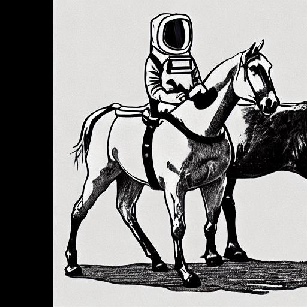
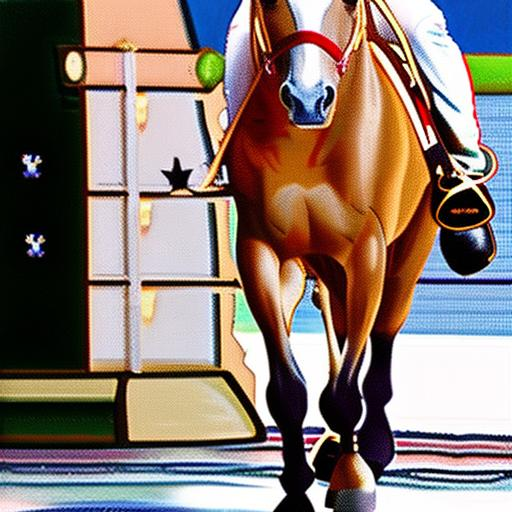
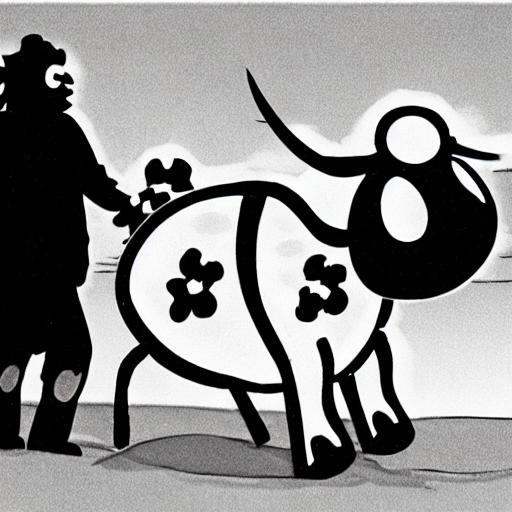

# Results
Category "Conflicting" in the benchmark: 

<table class="center">
	<tr><td style="text-align:center;", colspan="3"><b>26:A horse riding an astronaut.</b></td></tr>
	<tr>
		<td></td>
		<td></td>
		<td></td>
	</tr><tr>
		<td width=33% style="text-align:center;">CompVis-stable-diffusion-v1-4</td>
		<td width=33% style="text-align:center;">runwayml-stable-diffusion-v1-5</td>
		<td width=33% style="text-align:center;">stabilityai-stable-diffusion-2-1</td>
	</tr>
	<tr><td style="text-align:center;", colspan="3"><b>27:A pizza cooking an oven.</b></td></tr>
	<tr>
		<td></td>
		<td></td>
		<td></td>
	</tr><tr>
		<td width=33% style="text-align:center;">CompVis-stable-diffusion-v1-4</td>
		<td width=33% style="text-align:center;">runwayml-stable-diffusion-v1-5</td>
		<td width=33% style="text-align:center;">stabilityai-stable-diffusion-2-1</td>
	</tr>
	<tr><td style="text-align:center;", colspan="3"><b>28:A bird scaring a scarecrow.</b></td></tr>
	<tr>
		<td></td>
		<td></td>
		<td></td>
	</tr><tr>
		<td width=33% style="text-align:center;">CompVis-stable-diffusion-v1-4</td>
		<td width=33% style="text-align:center;">runwayml-stable-diffusion-v1-5</td>
		<td width=33% style="text-align:center;">stabilityai-stable-diffusion-2-1</td>
	</tr>
	<tr><td style="text-align:center;", colspan="3"><b>29:A blue coloured pizza.</b></td></tr>
	<tr>
		<td></td>
		<td></td>
		<td></td>
	</tr><tr>
		<td width=33% style="text-align:center;">CompVis-stable-diffusion-v1-4</td>
		<td width=33% style="text-align:center;">runwayml-stable-diffusion-v1-5</td>
		<td width=33% style="text-align:center;">stabilityai-stable-diffusion-2-1</td>
	</tr>
	<tr><td style="text-align:center;", colspan="3"><b>30:Hovering cow abducting aliens.</b></td></tr>
	<tr>
		<td></td>
		<td></td>
		<td></td>
	</tr><tr>
		<td width=33% style="text-align:center;">CompVis-stable-diffusion-v1-4</td>
		<td width=33% style="text-align:center;">runwayml-stable-diffusion-v1-5</td>
		<td width=33% style="text-align:center;">stabilityai-stable-diffusion-2-1</td>
	</tr>
	<tr><td style="text-align:center;", colspan="3"><b>31:A panda making latte art.</b></td></tr>
	<tr>
		<td></td>
		<td></td>
		<td></td>
	</tr><tr>
		<td width=33% style="text-align:center;">CompVis-stable-diffusion-v1-4</td>
		<td width=33% style="text-align:center;">runwayml-stable-diffusion-v1-5</td>
		<td width=33% style="text-align:center;">stabilityai-stable-diffusion-2-1</td>
	</tr>
	<tr><td style="text-align:center;", colspan="3"><b>32:A shark in the desert.</b></td></tr>
	<tr>
		<td></td>
		<td></td>
		<td></td>
	</tr><tr>
		<td width=33% style="text-align:center;">CompVis-stable-diffusion-v1-4</td>
		<td width=33% style="text-align:center;">runwayml-stable-diffusion-v1-5</td>
		<td width=33% style="text-align:center;">stabilityai-stable-diffusion-2-1</td>
	</tr>
	<tr><td style="text-align:center;", colspan="3"><b>33:An elephant under the sea.</b></td></tr>
	<tr>
		<td></td>
		<td></td>
		<td></td>
	</tr><tr>
		<td width=33% style="text-align:center;">CompVis-stable-diffusion-v1-4</td>
		<td width=33% style="text-align:center;">runwayml-stable-diffusion-v1-5</td>
		<td width=33% style="text-align:center;">stabilityai-stable-diffusion-2-1</td>
	</tr>
	<tr><td style="text-align:center;", colspan="3"><b>34:Rainbow coloured penguin.</b></td></tr>
	<tr>
		<td></td>
		<td></td>
		<td></td>
	</tr><tr>
		<td width=33% style="text-align:center;">CompVis-stable-diffusion-v1-4</td>
		<td width=33% style="text-align:center;">runwayml-stable-diffusion-v1-5</td>
		<td width=33% style="text-align:center;">stabilityai-stable-diffusion-2-1</td>
	</tr>
	<tr><td style="text-align:center;", colspan="3"><b>35:A fish eating a pelican.</b></td></tr>
	<tr>
		<td></td>
		<td></td>
		<td></td>
	</tr><tr>
		<td width=33% style="text-align:center;">CompVis-stable-diffusion-v1-4</td>
		<td width=33% style="text-align:center;">runwayml-stable-diffusion-v1-5</td>
		<td width=33% style="text-align:center;">stabilityai-stable-diffusion-2-1</td>
	</tr>
</table>