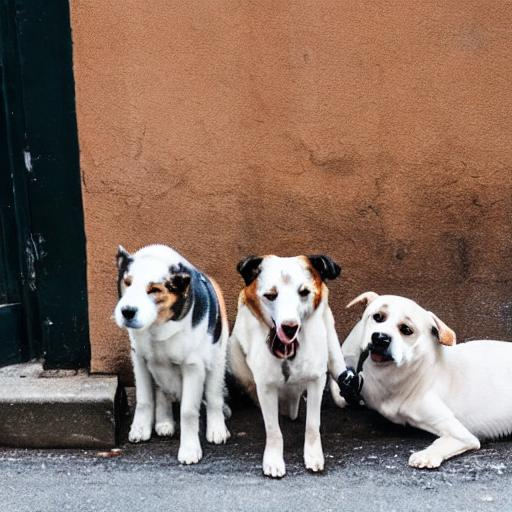

# Results
Category "Counting" in the benchmark: 

<table class="center">
	<tr><td style="text-align:center;", colspan="3"><b>36:One car on the street.</b></td></tr>
	<tr>
		<td></td>
		<td></td>
		<td></td>
	</tr><tr>
		<td width=33% style="text-align:center;">CompVis-stable-diffusion-v1-4</td>
		<td width=33% style="text-align:center;">runwayml-stable-diffusion-v1-5</td>
		<td width=33% style="text-align:center;">stabilityai-stable-diffusion-2-1</td>
	</tr>
	<tr><td style="text-align:center;", colspan="3"><b>37:Two cars on the street.</b></td></tr>
	<tr>
		<td></td>
		<td></td>
		<td></td>
	</tr><tr>
		<td width=33% style="text-align:center;">CompVis-stable-diffusion-v1-4</td>
		<td width=33% style="text-align:center;">runwayml-stable-diffusion-v1-5</td>
		<td width=33% style="text-align:center;">stabilityai-stable-diffusion-2-1</td>
	</tr>
	<tr><td style="text-align:center;", colspan="3"><b>38:Three cars on the street.</b></td></tr>
	<tr>
		<td></td>
		<td></td>
		<td></td>
	</tr><tr>
		<td width=33% style="text-align:center;">CompVis-stable-diffusion-v1-4</td>
		<td width=33% style="text-align:center;">runwayml-stable-diffusion-v1-5</td>
		<td width=33% style="text-align:center;">stabilityai-stable-diffusion-2-1</td>
	</tr>
	<tr><td style="text-align:center;", colspan="3"><b>39:Four cars on the street.</b></td></tr>
	<tr>
		<td></td>
		<td></td>
		<td></td>
	</tr><tr>
		<td width=33% style="text-align:center;">CompVis-stable-diffusion-v1-4</td>
		<td width=33% style="text-align:center;">runwayml-stable-diffusion-v1-5</td>
		<td width=33% style="text-align:center;">stabilityai-stable-diffusion-2-1</td>
	</tr>
	<tr><td style="text-align:center;", colspan="3"><b>40:Five cars on the street.</b></td></tr>
	<tr>
		<td></td>
		<td></td>
		<td></td>
	</tr><tr>
		<td width=33% style="text-align:center;">CompVis-stable-diffusion-v1-4</td>
		<td width=33% style="text-align:center;">runwayml-stable-diffusion-v1-5</td>
		<td width=33% style="text-align:center;">stabilityai-stable-diffusion-2-1</td>
	</tr>
	<tr><td style="text-align:center;", colspan="3"><b>41:One dog on the street.</b></td></tr>
	<tr>
		<td></td>
		<td></td>
		<td></td>
	</tr><tr>
		<td width=33% style="text-align:center;">CompVis-stable-diffusion-v1-4</td>
		<td width=33% style="text-align:center;">runwayml-stable-diffusion-v1-5</td>
		<td width=33% style="text-align:center;">stabilityai-stable-diffusion-2-1</td>
	</tr>
	<tr><td style="text-align:center;", colspan="3"><b>42:Two dogs on the street.</b></td></tr>
	<tr>
		<td></td>
		<td></td>
		<td></td>
	</tr><tr>
		<td width=33% style="text-align:center;">CompVis-stable-diffusion-v1-4</td>
		<td width=33% style="text-align:center;">runwayml-stable-diffusion-v1-5</td>
		<td width=33% style="text-align:center;">stabilityai-stable-diffusion-2-1</td>
	</tr>
	<tr><td style="text-align:center;", colspan="3"><b>43:Three dogs on the street.</b></td></tr>
	<tr>
		<td></td>
		<td></td>
		<td></td>
	</tr><tr>
		<td width=33% style="text-align:center;">CompVis-stable-diffusion-v1-4</td>
		<td width=33% style="text-align:center;">runwayml-stable-diffusion-v1-5</td>
		<td width=33% style="text-align:center;">stabilityai-stable-diffusion-2-1</td>
	</tr>
	<tr><td style="text-align:center;", colspan="3"><b>44:Four dogs on the street.</b></td></tr>
	<tr>
		<td></td>
		<td></td>
		<td></td>
	</tr><tr>
		<td width=33% style="text-align:center;">CompVis-stable-diffusion-v1-4</td>
		<td width=33% style="text-align:center;">runwayml-stable-diffusion-v1-5</td>
		<td width=33% style="text-align:center;">stabilityai-stable-diffusion-2-1</td>
	</tr>
	<tr><td style="text-align:center;", colspan="3"><b>45:Five dogs on the street.</b></td></tr>
	<tr>
		<td></td>
		<td></td>
		<td></td>
	</tr><tr>
		<td width=33% style="text-align:center;">CompVis-stable-diffusion-v1-4</td>
		<td width=33% style="text-align:center;">runwayml-stable-diffusion-v1-5</td>
		<td width=33% style="text-align:center;">stabilityai-stable-diffusion-2-1</td>
	</tr>
	<tr><td style="text-align:center;", colspan="3"><b>46:One cat and one dog sitting on the grass.</b></td></tr>
	<tr>
		<td></td>
		<td></td>
		<td></td>
	</tr><tr>
		<td width=33% style="text-align:center;">CompVis-stable-diffusion-v1-4</td>
		<td width=33% style="text-align:center;">runwayml-stable-diffusion-v1-5</td>
		<td width=33% style="text-align:center;">stabilityai-stable-diffusion-2-1</td>
	</tr>
	<tr><td style="text-align:center;", colspan="3"><b>47:One cat and two dogs sitting on the grass.</b></td></tr>
	<tr>
		<td></td>
		<td></td>
		<td></td>
	</tr><tr>
		<td width=33% style="text-align:center;">CompVis-stable-diffusion-v1-4</td>
		<td width=33% style="text-align:center;">runwayml-stable-diffusion-v1-5</td>
		<td width=33% style="text-align:center;">stabilityai-stable-diffusion-2-1</td>
	</tr>
	<tr><td style="text-align:center;", colspan="3"><b>48:One cat and three dogs sitting on the grass.</b></td></tr>
	<tr>
		<td></td>
		<td></td>
		<td></td>
	</tr><tr>
		<td width=33% style="text-align:center;">CompVis-stable-diffusion-v1-4</td>
		<td width=33% style="text-align:center;">runwayml-stable-diffusion-v1-5</td>
		<td width=33% style="text-align:center;">stabilityai-stable-diffusion-2-1</td>
	</tr>
	<tr><td style="text-align:center;", colspan="3"><b>49:Two cats and one dog sitting on the grass.</b></td></tr>
	<tr>
		<td></td>
		<td></td>
		<td></td>
	</tr><tr>
		<td width=33% style="text-align:center;">CompVis-stable-diffusion-v1-4</td>
		<td width=33% style="text-align:center;">runwayml-stable-diffusion-v1-5</td>
		<td width=33% style="text-align:center;">stabilityai-stable-diffusion-2-1</td>
	</tr>
	<tr><td style="text-align:center;", colspan="3"><b>50:Two cats and two dogs sitting on the grass.</b></td></tr>
	<tr>
		<td></td>
		<td></td>
		<td></td>
	</tr><tr>
		<td width=33% style="text-align:center;">CompVis-stable-diffusion-v1-4</td>
		<td width=33% style="text-align:center;">runwayml-stable-diffusion-v1-5</td>
		<td width=33% style="text-align:center;">stabilityai-stable-diffusion-2-1</td>
	</tr>
	<tr><td style="text-align:center;", colspan="3"><b>51:Two cats and three dogs sitting on the grass.</b></td></tr>
	<tr>
		<td></td>
		<td></td>
		<td></td>
	</tr><tr>
		<td width=33% style="text-align:center;">CompVis-stable-diffusion-v1-4</td>
		<td width=33% style="text-align:center;">runwayml-stable-diffusion-v1-5</td>
		<td width=33% style="text-align:center;">stabilityai-stable-diffusion-2-1</td>
	</tr>
	<tr><td style="text-align:center;", colspan="3"><b>52:Three cats and one dog sitting on the grass.</b></td></tr>
	<tr>
		<td></td>
		<td></td>
		<td></td>
	</tr><tr>
		<td width=33% style="text-align:center;">CompVis-stable-diffusion-v1-4</td>
		<td width=33% style="text-align:center;">runwayml-stable-diffusion-v1-5</td>
		<td width=33% style="text-align:center;">stabilityai-stable-diffusion-2-1</td>
	</tr>
	<tr><td style="text-align:center;", colspan="3"><b>53:Three cats and two dogs sitting on the grass.</b></td></tr>
	<tr>
		<td></td>
		<td></td>
		<td></td>
	</tr><tr>
		<td width=33% style="text-align:center;">CompVis-stable-diffusion-v1-4</td>
		<td width=33% style="text-align:center;">runwayml-stable-diffusion-v1-5</td>
		<td width=33% style="text-align:center;">stabilityai-stable-diffusion-2-1</td>
	</tr>
	<tr><td style="text-align:center;", colspan="3"><b>54:Three cats and three dogs sitting on the grass.</b></td></tr>
	<tr>
		<td></td>
		<td></td>
		<td></td>
	</tr><tr>
		<td width=33% style="text-align:center;">CompVis-stable-diffusion-v1-4</td>
		<td width=33% style="text-align:center;">runwayml-stable-diffusion-v1-5</td>
		<td width=33% style="text-align:center;">stabilityai-stable-diffusion-2-1</td>
	</tr>
</table>