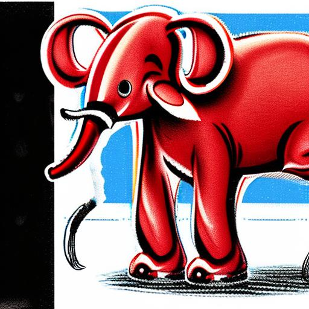

# Results
Category "DALL-E" in the benchmark: 

<table class="center">
	<tr><td style="text-align:center;", colspan="3"><b>55:A triangular purple flower pot. A purple flower pot in the shape of a triangle.</b></td></tr>
	<tr>
		<td></td>
		<td></td>
		<td></td>
	</tr><tr>
		<td width=33% style="text-align:center;">CompVis-stable-diffusion-v1-4</td>
		<td width=33% style="text-align:center;">runwayml-stable-diffusion-v1-5</td>
		<td width=33% style="text-align:center;">stabilityai-stable-diffusion-2-1</td>
	</tr>
	<tr><td style="text-align:center;", colspan="3"><b>56:A triangular orange picture frame. An orange picture frame in the shape of a triangle.</b></td></tr>
	<tr>
		<td></td>
		<td></td>
		<td></td>
	</tr><tr>
		<td width=33% style="text-align:center;">CompVis-stable-diffusion-v1-4</td>
		<td width=33% style="text-align:center;">runwayml-stable-diffusion-v1-5</td>
		<td width=33% style="text-align:center;">stabilityai-stable-diffusion-2-1</td>
	</tr>
	<tr><td style="text-align:center;", colspan="3"><b>57:A triangular pink stop sign. A pink stop sign in the shape of a triangle.</b></td></tr>
	<tr>
		<td></td>
		<td></td>
		<td></td>
	</tr><tr>
		<td width=33% style="text-align:center;">CompVis-stable-diffusion-v1-4</td>
		<td width=33% style="text-align:center;">runwayml-stable-diffusion-v1-5</td>
		<td width=33% style="text-align:center;">stabilityai-stable-diffusion-2-1</td>
	</tr>
	<tr><td style="text-align:center;", colspan="3"><b>58:A cube made of denim. A cube with the texture of denim.</b></td></tr>
	<tr>
		<td></td>
		<td></td>
		<td></td>
	</tr><tr>
		<td width=33% style="text-align:center;">CompVis-stable-diffusion-v1-4</td>
		<td width=33% style="text-align:center;">runwayml-stable-diffusion-v1-5</td>
		<td width=33% style="text-align:center;">stabilityai-stable-diffusion-2-1</td>
	</tr>
	<tr><td style="text-align:center;", colspan="3"><b>59:A sphere made of kitchen tile. A sphere with the texture of kitchen tile.</b></td></tr>
	<tr>
		<td></td>
		<td></td>
		<td></td>
	</tr><tr>
		<td width=33% style="text-align:center;">CompVis-stable-diffusion-v1-4</td>
		<td width=33% style="text-align:center;">runwayml-stable-diffusion-v1-5</td>
		<td width=33% style="text-align:center;">stabilityai-stable-diffusion-2-1</td>
	</tr>
	<tr><td style="text-align:center;", colspan="3"><b>60:A cube made of brick. A cube with the texture of brick.</b></td></tr>
	<tr>
		<td></td>
		<td></td>
		<td></td>
	</tr><tr>
		<td width=33% style="text-align:center;">CompVis-stable-diffusion-v1-4</td>
		<td width=33% style="text-align:center;">runwayml-stable-diffusion-v1-5</td>
		<td width=33% style="text-align:center;">stabilityai-stable-diffusion-2-1</td>
	</tr>
	<tr><td style="text-align:center;", colspan="3"><b>61:A collection of nail is sitting on a table.</b></td></tr>
	<tr>
		<td></td>
		<td></td>
		<td></td>
	</tr><tr>
		<td width=33% style="text-align:center;">CompVis-stable-diffusion-v1-4</td>
		<td width=33% style="text-align:center;">runwayml-stable-diffusion-v1-5</td>
		<td width=33% style="text-align:center;">stabilityai-stable-diffusion-2-1</td>
	</tr>
	<tr><td style="text-align:center;", colspan="3"><b>62:A single clock is sitting on a table.</b></td></tr>
	<tr>
		<td></td>
		<td></td>
		<td></td>
	</tr><tr>
		<td width=33% style="text-align:center;">CompVis-stable-diffusion-v1-4</td>
		<td width=33% style="text-align:center;">runwayml-stable-diffusion-v1-5</td>
		<td width=33% style="text-align:center;">stabilityai-stable-diffusion-2-1</td>
	</tr>
	<tr><td style="text-align:center;", colspan="3"><b>63:A couple of glasses are sitting on a table.</b></td></tr>
	<tr>
		<td></td>
		<td></td>
		<td></td>
	</tr><tr>
		<td width=33% style="text-align:center;">CompVis-stable-diffusion-v1-4</td>
		<td width=33% style="text-align:center;">runwayml-stable-diffusion-v1-5</td>
		<td width=33% style="text-align:center;">stabilityai-stable-diffusion-2-1</td>
	</tr>
	<tr><td style="text-align:center;", colspan="3"><b>64:An illustration of a large red elephant sitting on a small blue mouse.</b></td></tr>
	<tr>
		<td></td>
		<td></td>
		<td></td>
	</tr><tr>
		<td width=33% style="text-align:center;">CompVis-stable-diffusion-v1-4</td>
		<td width=33% style="text-align:center;">runwayml-stable-diffusion-v1-5</td>
		<td width=33% style="text-align:center;">stabilityai-stable-diffusion-2-1</td>
	</tr>
	<tr><td style="text-align:center;", colspan="3"><b>65:An illustration of a small green elephant standing behind a large red mouse.</b></td></tr>
	<tr>
		<td></td>
		<td></td>
		<td></td>
	</tr><tr>
		<td width=33% style="text-align:center;">CompVis-stable-diffusion-v1-4</td>
		<td width=33% style="text-align:center;">runwayml-stable-diffusion-v1-5</td>
		<td width=33% style="text-align:center;">stabilityai-stable-diffusion-2-1</td>
	</tr>
	<tr><td style="text-align:center;", colspan="3"><b>66:A small blue book sitting on a large red book.</b></td></tr>
	<tr>
		<td></td>
		<td></td>
		<td></td>
	</tr><tr>
		<td width=33% style="text-align:center;">CompVis-stable-diffusion-v1-4</td>
		<td width=33% style="text-align:center;">runwayml-stable-diffusion-v1-5</td>
		<td width=33% style="text-align:center;">stabilityai-stable-diffusion-2-1</td>
	</tr>
	<tr><td style="text-align:center;", colspan="3"><b>67:A stack of 3 plates. A blue plate is on the top, sitting on a blue plate. The blue plate is in the middle, sitting on a green plate. The green plate is on the bottom.</b></td></tr>
	<tr>
		<td></td>
		<td></td>
		<td></td>
	</tr><tr>
		<td width=33% style="text-align:center;">CompVis-stable-diffusion-v1-4</td>
		<td width=33% style="text-align:center;">runwayml-stable-diffusion-v1-5</td>
		<td width=33% style="text-align:center;">stabilityai-stable-diffusion-2-1</td>
	</tr>
	<tr><td style="text-align:center;", colspan="3"><b>68:A stack of 3 cubes. A red cube is on the top, sitting on a red cube. The red cube is in the middle, sitting on a green cube. The green cube is on the bottom.</b></td></tr>
	<tr>
		<td></td>
		<td></td>
		<td></td>
	</tr><tr>
		<td width=33% style="text-align:center;">CompVis-stable-diffusion-v1-4</td>
		<td width=33% style="text-align:center;">runwayml-stable-diffusion-v1-5</td>
		<td width=33% style="text-align:center;">stabilityai-stable-diffusion-2-1</td>
	</tr>
	<tr><td style="text-align:center;", colspan="3"><b>69:A stack of 3 books. A green book is on the top, sitting on a red book. The red book is in the middle, sitting on a blue book. The blue book is on the bottom.</b></td></tr>
	<tr>
		<td></td>
		<td></td>
		<td></td>
	</tr><tr>
		<td width=33% style="text-align:center;">CompVis-stable-diffusion-v1-4</td>
		<td width=33% style="text-align:center;">runwayml-stable-diffusion-v1-5</td>
		<td width=33% style="text-align:center;">stabilityai-stable-diffusion-2-1</td>
	</tr>
	<tr><td style="text-align:center;", colspan="3"><b>70:An emoji of a baby panda wearing a red hat, green gloves, red shirt, and green pants.</b></td></tr>
	<tr>
		<td></td>
		<td></td>
		<td></td>
	</tr><tr>
		<td width=33% style="text-align:center;">CompVis-stable-diffusion-v1-4</td>
		<td width=33% style="text-align:center;">runwayml-stable-diffusion-v1-5</td>
		<td width=33% style="text-align:center;">stabilityai-stable-diffusion-2-1</td>
	</tr>
	<tr><td style="text-align:center;", colspan="3"><b>71:An emoji of a baby panda wearing a red hat, blue gloves, green shirt, and blue pants.</b></td></tr>
	<tr>
		<td></td>
		<td></td>
		<td></td>
	</tr><tr>
		<td width=33% style="text-align:center;">CompVis-stable-diffusion-v1-4</td>
		<td width=33% style="text-align:center;">runwayml-stable-diffusion-v1-5</td>
		<td width=33% style="text-align:center;">stabilityai-stable-diffusion-2-1</td>
	</tr>
	<tr><td style="text-align:center;", colspan="3"><b>72:A fisheye lens view of a turtle sitting in a forest.</b></td></tr>
	<tr>
		<td></td>
		<td></td>
		<td></td>
	</tr><tr>
		<td width=33% style="text-align:center;">CompVis-stable-diffusion-v1-4</td>
		<td width=33% style="text-align:center;">runwayml-stable-diffusion-v1-5</td>
		<td width=33% style="text-align:center;">stabilityai-stable-diffusion-2-1</td>
	</tr>
	<tr><td style="text-align:center;", colspan="3"><b>73:A side view of an owl sitting in a field.</b></td></tr>
	<tr>
		<td></td>
		<td></td>
		<td></td>
	</tr><tr>
		<td width=33% style="text-align:center;">CompVis-stable-diffusion-v1-4</td>
		<td width=33% style="text-align:center;">runwayml-stable-diffusion-v1-5</td>
		<td width=33% style="text-align:center;">stabilityai-stable-diffusion-2-1</td>
	</tr>
	<tr><td style="text-align:center;", colspan="3"><b>74:A cross-section view of a brain.</b></td></tr>
	<tr>
		<td></td>
		<td></td>
		<td></td>
	</tr><tr>
		<td width=33% style="text-align:center;">CompVis-stable-diffusion-v1-4</td>
		<td width=33% style="text-align:center;">runwayml-stable-diffusion-v1-5</td>
		<td width=33% style="text-align:center;">stabilityai-stable-diffusion-2-1</td>
	</tr>
</table>