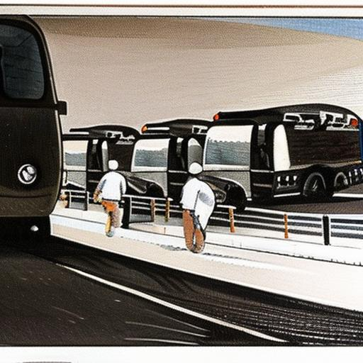
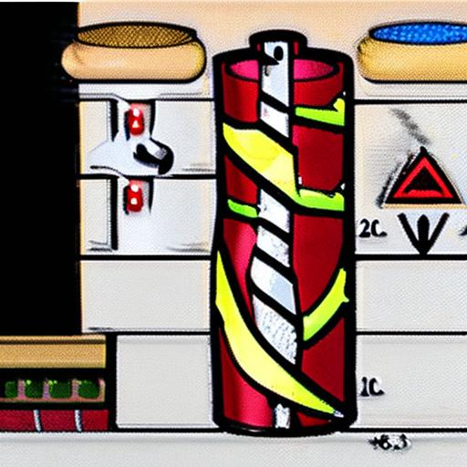
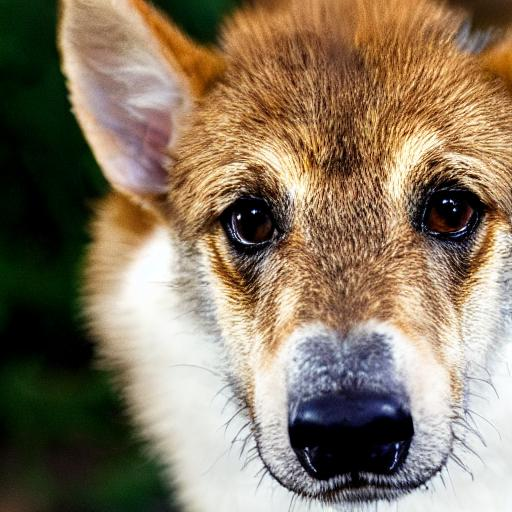
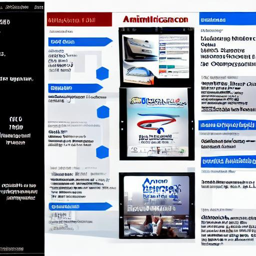
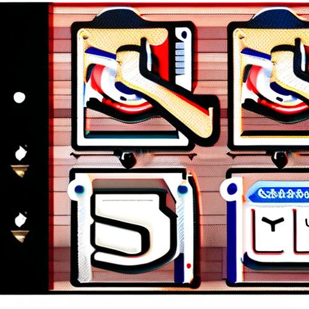

# Results
Category "Descriptions" in the benchmark: 

<table class="center">
	<tr><td style="text-align:center;", colspan="3"><b>75:A vehicle composed of two wheels held in a frame one behind the other, propelled by pedals and steered with handlebars attached to the front wheel.</b></td></tr>
	<tr>
		<td></td>
		<td></td>
		<td></td>
	</tr><tr>
		<td width=33% style="text-align:center;">CompVis-stable-diffusion-v1-4</td>
		<td width=33% style="text-align:center;">runwayml-stable-diffusion-v1-5</td>
		<td width=33% style="text-align:center;">stabilityai-stable-diffusion-2-1</td>
	</tr>
	<tr><td style="text-align:center;", colspan="3"><b>76:A large motor vehicle carrying passengers by road, typically one serving the public on a fixed route and for a fare.</b></td></tr>
	<tr>
		<td></td>
		<td></td>
		<td></td>
	</tr><tr>
		<td width=33% style="text-align:center;">CompVis-stable-diffusion-v1-4</td>
		<td width=33% style="text-align:center;">runwayml-stable-diffusion-v1-5</td>
		<td width=33% style="text-align:center;">stabilityai-stable-diffusion-2-1</td>
	</tr>
	<tr><td style="text-align:center;", colspan="3"><b>77:A small vessel propelled on water by oars, sails, or an engine.</b></td></tr>
	<tr>
		<td></td>
		<td></td>
		<td></td>
	</tr><tr>
		<td width=33% style="text-align:center;">CompVis-stable-diffusion-v1-4</td>
		<td width=33% style="text-align:center;">runwayml-stable-diffusion-v1-5</td>
		<td width=33% style="text-align:center;">stabilityai-stable-diffusion-2-1</td>
	</tr>
	<tr><td style="text-align:center;", colspan="3"><b>78:A connection point by which firefighters can tap into a water supply.</b></td></tr>
	<tr>
		<td></td>
		<td></td>
		<td></td>
	</tr><tr>
		<td width=33% style="text-align:center;">CompVis-stable-diffusion-v1-4</td>
		<td width=33% style="text-align:center;">runwayml-stable-diffusion-v1-5</td>
		<td width=33% style="text-align:center;">stabilityai-stable-diffusion-2-1</td>
	</tr>
	<tr><td style="text-align:center;", colspan="3"><b>79:A machine next to a parking space in a street, into which the driver puts money so as to be authorized to park the vehicle for a particular length of time.</b></td></tr>
	<tr>
		<td></td>
		<td></td>
		<td></td>
	</tr><tr>
		<td width=33% style="text-align:center;">CompVis-stable-diffusion-v1-4</td>
		<td width=33% style="text-align:center;">runwayml-stable-diffusion-v1-5</td>
		<td width=33% style="text-align:center;">stabilityai-stable-diffusion-2-1</td>
	</tr>
	<tr><td style="text-align:center;", colspan="3"><b>80:A device consisting of a circular canopy of cloth on a folding metal frame supported by a central rod, used as protection against rain or sometimes sun.</b></td></tr>
	<tr>
		<td></td>
		<td></td>
		<td></td>
	</tr><tr>
		<td width=33% style="text-align:center;">CompVis-stable-diffusion-v1-4</td>
		<td width=33% style="text-align:center;">runwayml-stable-diffusion-v1-5</td>
		<td width=33% style="text-align:center;">stabilityai-stable-diffusion-2-1</td>
	</tr>
	<tr><td style="text-align:center;", colspan="3"><b>81:A separate seat for one person, typically with a back and four legs.</b></td></tr>
	<tr>
		<td></td>
		<td></td>
		<td></td>
	</tr><tr>
		<td width=33% style="text-align:center;">CompVis-stable-diffusion-v1-4</td>
		<td width=33% style="text-align:center;">runwayml-stable-diffusion-v1-5</td>
		<td width=33% style="text-align:center;">stabilityai-stable-diffusion-2-1</td>
	</tr>
	<tr><td style="text-align:center;", colspan="3"><b>82:An appliance or compartment which is artificially kept cool and used to store food and drink.</b></td></tr>
	<tr>
		<td></td>
		<td></td>
		<td></td>
	</tr><tr>
		<td width=33% style="text-align:center;">CompVis-stable-diffusion-v1-4</td>
		<td width=33% style="text-align:center;">runwayml-stable-diffusion-v1-5</td>
		<td width=33% style="text-align:center;">stabilityai-stable-diffusion-2-1</td>
	</tr>
	<tr><td style="text-align:center;", colspan="3"><b>83:A mechanical or electrical device for measuring time.</b></td></tr>
	<tr>
		<td></td>
		<td></td>
		<td></td>
	</tr><tr>
		<td width=33% style="text-align:center;">CompVis-stable-diffusion-v1-4</td>
		<td width=33% style="text-align:center;">runwayml-stable-diffusion-v1-5</td>
		<td width=33% style="text-align:center;">stabilityai-stable-diffusion-2-1</td>
	</tr>
	<tr><td style="text-align:center;", colspan="3"><b>84:An instrument used for cutting cloth, paper, and other thin material, consisting of two blades laid one on top of the other and fastened in the middle so as to allow them to be opened and closed by a thumb and finger inserted through rings on the end of their handles.</b></td></tr>
	<tr>
		<td></td>
		<td></td>
		<td></td>
	</tr><tr>
		<td width=33% style="text-align:center;">CompVis-stable-diffusion-v1-4</td>
		<td width=33% style="text-align:center;">runwayml-stable-diffusion-v1-5</td>
		<td width=33% style="text-align:center;">stabilityai-stable-diffusion-2-1</td>
	</tr>
	<tr><td style="text-align:center;", colspan="3"><b>85:A large plant-eating domesticated mammal with solid hoofs and a flowing mane and tail, used for riding, racing, and to carry and pull loads.</b></td></tr>
	<tr>
		<td></td>
		<td></td>
		<td></td>
	</tr><tr>
		<td width=33% style="text-align:center;">CompVis-stable-diffusion-v1-4</td>
		<td width=33% style="text-align:center;">runwayml-stable-diffusion-v1-5</td>
		<td width=33% style="text-align:center;">stabilityai-stable-diffusion-2-1</td>
	</tr>
	<tr><td style="text-align:center;", colspan="3"><b>86:A long curved fruit which grows in clusters and has soft pulpy flesh and yellow skin when ripe.</b></td></tr>
	<tr>
		<td></td>
		<td></td>
		<td></td>
	</tr><tr>
		<td width=33% style="text-align:center;">CompVis-stable-diffusion-v1-4</td>
		<td width=33% style="text-align:center;">runwayml-stable-diffusion-v1-5</td>
		<td width=33% style="text-align:center;">stabilityai-stable-diffusion-2-1</td>
	</tr>
	<tr><td style="text-align:center;", colspan="3"><b>87:A small domesticated carnivorous mammal with soft fur, a short snout, and retractable claws. It is widely kept as a pet or for catching mice, and many breeds have been developed.</b></td></tr>
	<tr>
		<td></td>
		<td></td>
		<td></td>
	</tr><tr>
		<td width=33% style="text-align:center;">CompVis-stable-diffusion-v1-4</td>
		<td width=33% style="text-align:center;">runwayml-stable-diffusion-v1-5</td>
		<td width=33% style="text-align:center;">stabilityai-stable-diffusion-2-1</td>
	</tr>
	<tr><td style="text-align:center;", colspan="3"><b>88:A domesticated carnivorous mammal that typically has a long snout, an acute sense of smell, nonretractable claws, and a barking, howling, or whining voice.</b></td></tr>
	<tr>
		<td></td>
		<td></td>
		<td></td>
	</tr><tr>
		<td width=33% style="text-align:center;">CompVis-stable-diffusion-v1-4</td>
		<td width=33% style="text-align:center;">runwayml-stable-diffusion-v1-5</td>
		<td width=33% style="text-align:center;">stabilityai-stable-diffusion-2-1</td>
	</tr>
	<tr><td style="text-align:center;", colspan="3"><b>89:An organ of soft nervous tissue contained in the skull of vertebrates, functioning as the coordinating center of sensation and intellectual and nervous activity.</b></td></tr>
	<tr>
		<td></td>
		<td></td>
		<td></td>
	</tr><tr>
		<td width=33% style="text-align:center;">CompVis-stable-diffusion-v1-4</td>
		<td width=33% style="text-align:center;">runwayml-stable-diffusion-v1-5</td>
		<td width=33% style="text-align:center;">stabilityai-stable-diffusion-2-1</td>
	</tr>
	<tr><td style="text-align:center;", colspan="3"><b>90:An American multinational technology company that focuses on artificial intelligence, search engine, online advertising, cloud computing, computer software, quantum computing, e-commerce, and consumer electronics.</b></td></tr>
	<tr>
		<td></td>
		<td></td>
		<td></td>
	</tr><tr>
		<td width=33% style="text-align:center;">CompVis-stable-diffusion-v1-4</td>
		<td width=33% style="text-align:center;">runwayml-stable-diffusion-v1-5</td>
		<td width=33% style="text-align:center;">stabilityai-stable-diffusion-2-1</td>
	</tr>
	<tr><td style="text-align:center;", colspan="3"><b>91:A large keyboard musical instrument with a wooden case enclosing a soundboard and metal strings, which are struck by hammers when the keys are depressed. The strings' vibration is stopped by dampers when the keys are released and can be regulated for length and volume by two or three pedals.</b></td></tr>
	<tr>
		<td></td>
		<td></td>
		<td></td>
	</tr><tr>
		<td width=33% style="text-align:center;">CompVis-stable-diffusion-v1-4</td>
		<td width=33% style="text-align:center;">runwayml-stable-diffusion-v1-5</td>
		<td width=33% style="text-align:center;">stabilityai-stable-diffusion-2-1</td>
	</tr>
	<tr><td style="text-align:center;", colspan="3"><b>92:A type of digital currency in which a record of transactions is maintained and new units of currency are generated by the computational solution of mathematical problems, and which operates independently of a central bank.</b></td></tr>
	<tr>
		<td></td>
		<td></td>
		<td></td>
	</tr><tr>
		<td width=33% style="text-align:center;">CompVis-stable-diffusion-v1-4</td>
		<td width=33% style="text-align:center;">runwayml-stable-diffusion-v1-5</td>
		<td width=33% style="text-align:center;">stabilityai-stable-diffusion-2-1</td>
	</tr>
	<tr><td style="text-align:center;", colspan="3"><b>93:A large thick-skinned semiaquatic African mammal, with massive jaws and large tusks.</b></td></tr>
	<tr>
		<td></td>
		<td></td>
		<td></td>
	</tr><tr>
		<td width=33% style="text-align:center;">CompVis-stable-diffusion-v1-4</td>
		<td width=33% style="text-align:center;">runwayml-stable-diffusion-v1-5</td>
		<td width=33% style="text-align:center;">stabilityai-stable-diffusion-2-1</td>
	</tr>
	<tr><td style="text-align:center;", colspan="3"><b>94:A machine resembling a human being and able to replicate certain human movements and functions automatically.</b></td></tr>
	<tr>
		<td></td>
		<td></td>
		<td></td>
	</tr><tr>
		<td width=33% style="text-align:center;">CompVis-stable-diffusion-v1-4</td>
		<td width=33% style="text-align:center;">runwayml-stable-diffusion-v1-5</td>
		<td width=33% style="text-align:center;">stabilityai-stable-diffusion-2-1</td>
	</tr>
</table>