# Results
Category "Misspellings" in the benchmark: 

<table class="center">
	<tr><td style="text-align:center;", colspan="3"><b>105:Tcennis rpacket.</b></td></tr>
	<tr>
		<td>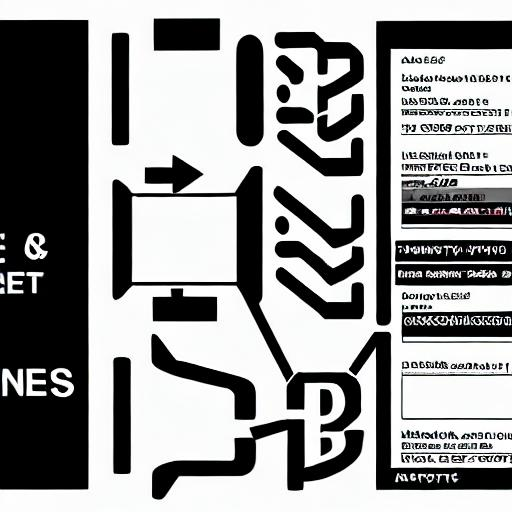</td>
		<td>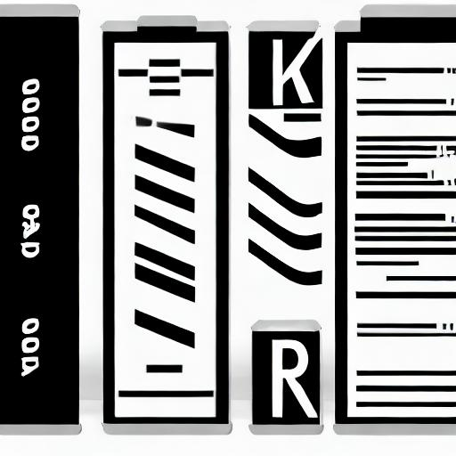</td>
		<td>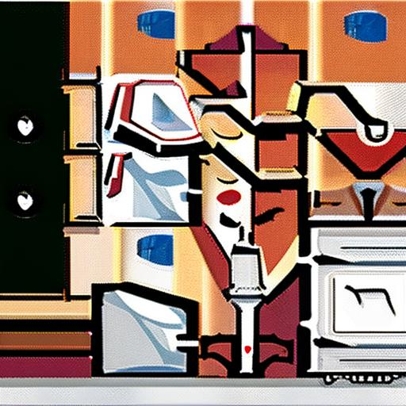</td>
	</tr><tr>
		<td width=33% style="text-align:center;">CompVis-stable-diffusion-v1-4</td>
		<td width=33% style="text-align:center;">runwayml-stable-diffusion-v1-5</td>
		<td width=33% style="text-align:center;">stabilityai-stable-diffusion-2-1</td>
	</tr>
	<tr><td style="text-align:center;", colspan="3"><b>106:Bzaseball galove.</b></td></tr>
	<tr>
		<td></td>
		<td></td>
		<td></td>
	</tr><tr>
		<td width=33% style="text-align:center;">CompVis-stable-diffusion-v1-4</td>
		<td width=33% style="text-align:center;">runwayml-stable-diffusion-v1-5</td>
		<td width=33% style="text-align:center;">stabilityai-stable-diffusion-2-1</td>
	</tr>
	<tr><td style="text-align:center;", colspan="3"><b>107:Rbefraigerator.</b></td></tr>
	<tr>
		<td>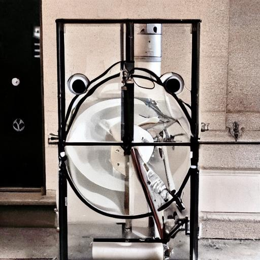</td>
		<td></td>
		<td>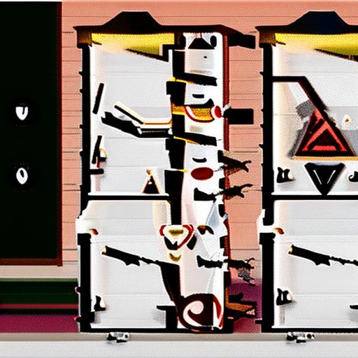</td>
	</tr><tr>
		<td width=33% style="text-align:center;">CompVis-stable-diffusion-v1-4</td>
		<td width=33% style="text-align:center;">runwayml-stable-diffusion-v1-5</td>
		<td width=33% style="text-align:center;">stabilityai-stable-diffusion-2-1</td>
	</tr>
	<tr><td style="text-align:center;", colspan="3"><b>108:Dininrg tablez.</b></td></tr>
	<tr>
		<td>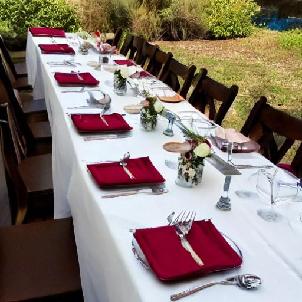</td>
		<td>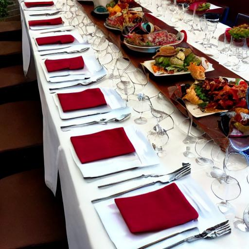</td>
		<td>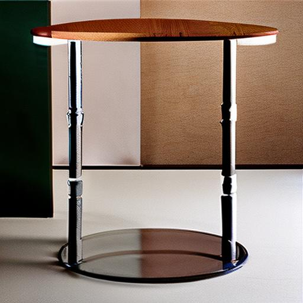</td>
	</tr><tr>
		<td width=33% style="text-align:center;">CompVis-stable-diffusion-v1-4</td>
		<td width=33% style="text-align:center;">runwayml-stable-diffusion-v1-5</td>
		<td width=33% style="text-align:center;">stabilityai-stable-diffusion-2-1</td>
	</tr>
	<tr><td style="text-align:center;", colspan="3"><b>109:Pafrking metr.</b></td></tr>
	<tr>
		<td></td>
		<td></td>
		<td>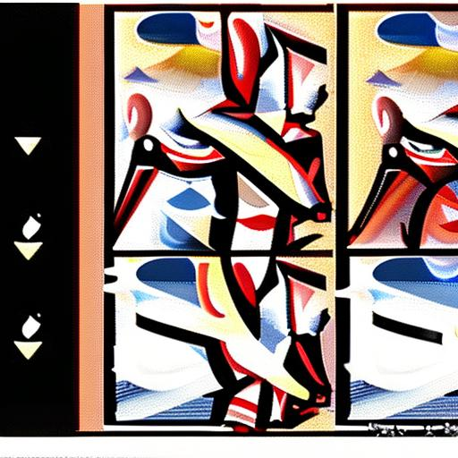</td>
	</tr><tr>
		<td width=33% style="text-align:center;">CompVis-stable-diffusion-v1-4</td>
		<td width=33% style="text-align:center;">runwayml-stable-diffusion-v1-5</td>
		<td width=33% style="text-align:center;">stabilityai-stable-diffusion-2-1</td>
	</tr>
	<tr><td style="text-align:center;", colspan="3"><b>110:A smafml vessef epropoeilled on watvewr by ors, sauls, or han engie.</b></td></tr>
	<tr>
		<td></td>
		<td></td>
		<td>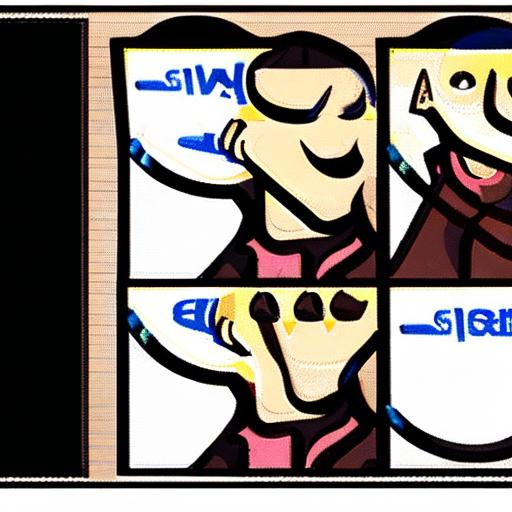</td>
	</tr><tr>
		<td width=33% style="text-align:center;">CompVis-stable-diffusion-v1-4</td>
		<td width=33% style="text-align:center;">runwayml-stable-diffusion-v1-5</td>
		<td width=33% style="text-align:center;">stabilityai-stable-diffusion-2-1</td>
	</tr>
	<tr><td style="text-align:center;", colspan="3"><b>111:A sjmall domesticated carnivorious mammnal with sof fuh,y a sthort sout, and retracwtablbe flaws. It iw widexly kept as a pet or for catchitng mic, ad many breeds zhlyde beefn develvoked.</b></td></tr>
	<tr>
		<td></td>
		<td></td>
		<td>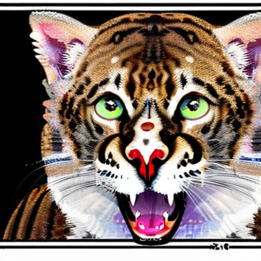</td>
	</tr><tr>
		<td width=33% style="text-align:center;">CompVis-stable-diffusion-v1-4</td>
		<td width=33% style="text-align:center;">runwayml-stable-diffusion-v1-5</td>
		<td width=33% style="text-align:center;">stabilityai-stable-diffusion-2-1</td>
	</tr>
	<tr><td style="text-align:center;", colspan="3"><b>112:An instqrumemnt used for cutting cloth, paper, axdz othr thdin mteroial, consamistng of two blades lad one on tvopb of the other and fhastned in tle mixdqdjle so as to bllow them txo be pened and closed by thumb and fitngesr inserted tgrough rings on kthe end oc thei vatndlzes.</b></td></tr>
	<tr>
		<td>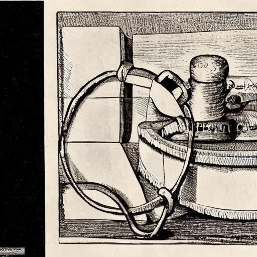</td>
		<td>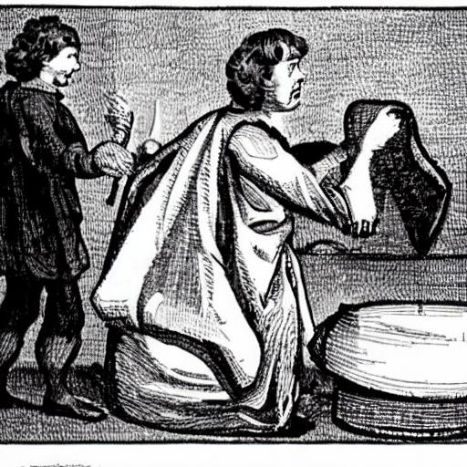</td>
		<td>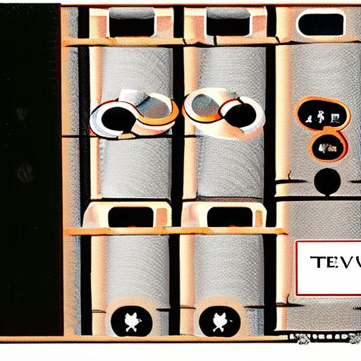</td>
	</tr><tr>
		<td width=33% style="text-align:center;">CompVis-stable-diffusion-v1-4</td>
		<td width=33% style="text-align:center;">runwayml-stable-diffusion-v1-5</td>
		<td width=33% style="text-align:center;">stabilityai-stable-diffusion-2-1</td>
	</tr>
	<tr><td style="text-align:center;", colspan="3"><b>113:A domesticated carnivvorous mzammal that typicbally hfaas a lons sfnout, an acxujte sense off osmell, noneetractaaln crlaws, anid xbarkring,y howlingu, or whining rvoiche.</b></td></tr>
	<tr>
		<td></td>
		<td></td>
		<td></td>
	</tr><tr>
		<td width=33% style="text-align:center;">CompVis-stable-diffusion-v1-4</td>
		<td width=33% style="text-align:center;">runwayml-stable-diffusion-v1-5</td>
		<td width=33% style="text-align:center;">stabilityai-stable-diffusion-2-1</td>
	</tr>
	<tr><td style="text-align:center;", colspan="3"><b>114:A ldarge keybord msical instroument lwith a woden case enmclosig a qsouvnkboajrd and mfgtal strivgf, which are strucrk b hammrs when the nels are depresdsmed.f lhe strsingsj' vibration ie stopped by damperds when the keys re released and can bce regulavewdd for lengh and vnolume y two or three pedalvs.</b></td></tr>
	<tr>
		<td></td>
		<td>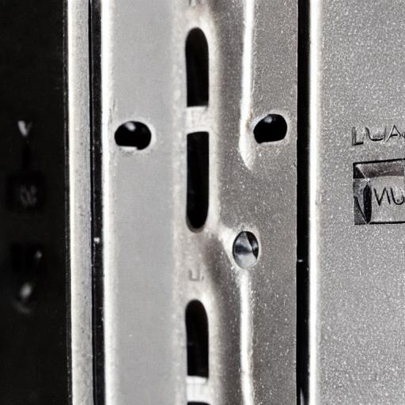</td>
		<td></td>
	</tr><tr>
		<td width=33% style="text-align:center;">CompVis-stable-diffusion-v1-4</td>
		<td width=33% style="text-align:center;">runwayml-stable-diffusion-v1-5</td>
		<td width=33% style="text-align:center;">stabilityai-stable-diffusion-2-1</td>
	</tr>
</table>