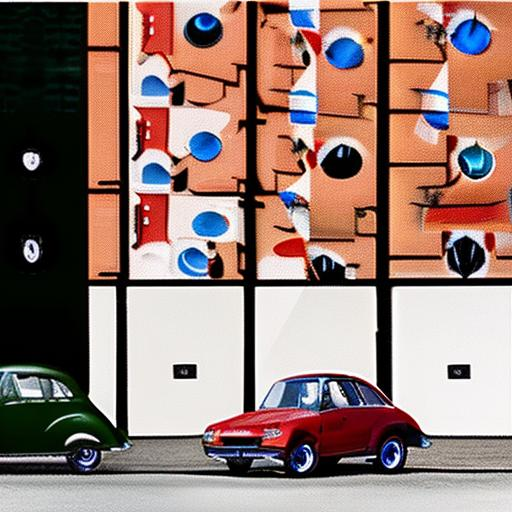
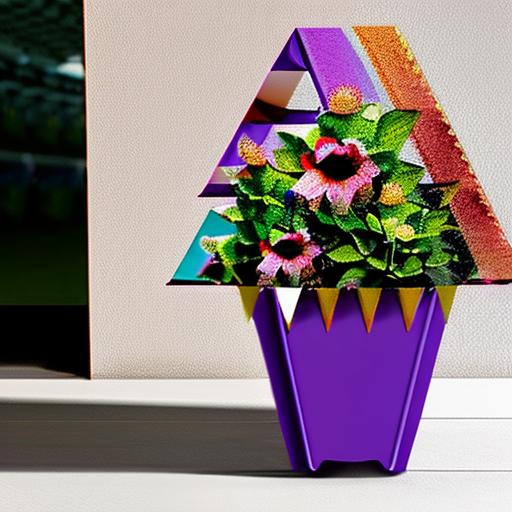
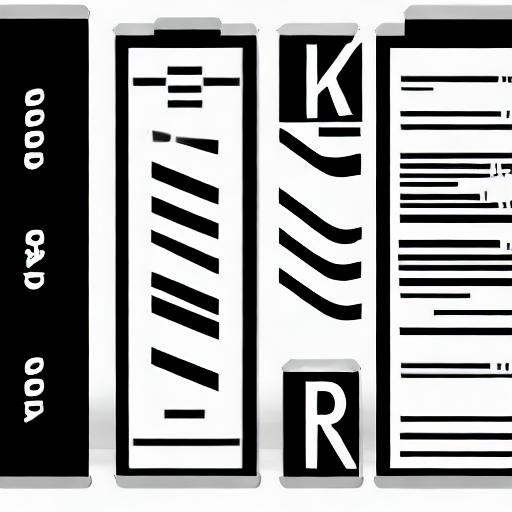
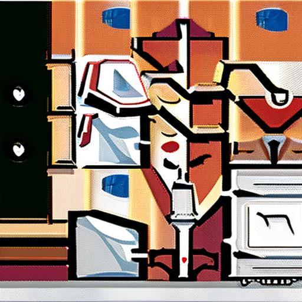
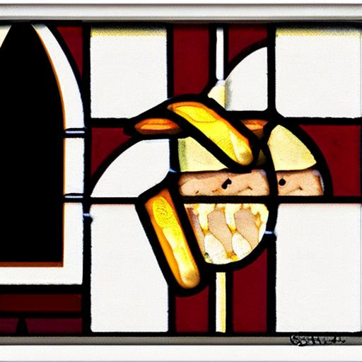
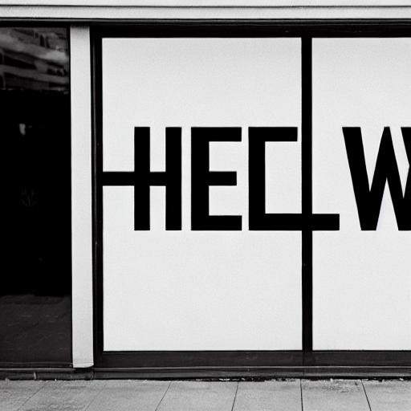

# DrawBench at a Glance

This repo compares images generated by awesome generative models on the [DrawBench](https://docs.google.com/spreadsheets/d/1y7nAbmR4FREi6npB1u-Bo3GFdwdOPYJc617rBOxIRHY/edit#gid=0) provided in Imagen. Currently, it includes images generated with some OpenSource image generative models (stable diffusion 1-4, 1-5, 2-1). One can browse the generated images and get a rough idea about the capability of these models. 

### Features
1. The repo includes results generated by 3 stable diffusion models (1-4, 1-5, 2-1) with 200 prompts from DrawBench, organized by prompt categories. 
2. The provided scripts can be used to generate images with additional prompts and private models and provide organized results. 

### Limitations
1. Currently, this repo only includes 3 OpenSource stable diffusion models.
2. Currently, this repo only includes images generated with one random seed (`0`), which makes the comparison not comprehensive.

### Generate the images on your own
1. Create a conda environment: `conda env create -f bench.yaml`.
2. Activate the conda environment: `conda activate bench`.
3. Run the notebook `GenImages.ipynb`. It takes ~30 minutes to generate a single image for 200 prompts with 3 different diffusion models on a single RTX3090.

### Preview

Each sub-directory includes the generation results of a single prompt category. Some examples are provided below as a preview.

<table class="center">
    <tr><td style="text-align:center;", colspan="3"><b>Category: Color</b></td></tr>
	<tr><td style="text-align:center;", colspan="3"><b>1:A red colored car.</b></td></tr>
	<tr>
		<td></td>
		<td></td>
		<td></td>
	</tr><tr>
		<td width=33% style="text-align:center;">CompVis-stable-diffusion-v1-4</td>
		<td width=33% style="text-align:center;">runwayml-stable-diffusion-v1-5</td>
		<td width=33% style="text-align:center;">stabilityai-stable-diffusion-2-1</td>
	</tr>
    <tr><td style="text-align:center;", colspan="3"><b>Category: Conflicting</b></td></tr>
    <tr><td style="text-align:center;", colspan="3"><b>26:A horse riding an astronaut.</b></td></tr>
	<tr>
		<td></td>
		<td></td>
		<td></td>
	</tr><tr>
		<td width=33% style="text-align:center;">CompVis-stable-diffusion-v1-4</td>
		<td width=33% style="text-align:center;">runwayml-stable-diffusion-v1-5</td>
		<td width=33% style="text-align:center;">stabilityai-stable-diffusion-2-1</td>
	</tr>
    <tr><td style="text-align:center;", colspan="3"><b>Category: Counting</b></td></tr>
    <tr><td style="text-align:center;", colspan="3"><b>36:One car on the street.</b></td></tr>
	<tr>
		<td></td>
		<td></td>
		<td></td>
	</tr><tr>
		<td width=33% style="text-align:center;">CompVis-stable-diffusion-v1-4</td>
		<td width=33% style="text-align:center;">runwayml-stable-diffusion-v1-5</td>
		<td width=33% style="text-align:center;">stabilityai-stable-diffusion-2-1</td>
	</tr>
    <tr><td style="text-align:center;", colspan="3"><b>Category: DALL-E</b></td></tr>
    <tr><td style="text-align:center;", colspan="3"><b>55:A triangular purple flower pot. A purple flower pot in the shape of a triangle.</b></td></tr>
	<tr>
		<td></td>
		<td></td>
		<td></td>
	</tr><tr>
		<td width=33% style="text-align:center;">CompVis-stable-diffusion-v1-4</td>
		<td width=33% style="text-align:center;">runwayml-stable-diffusion-v1-5</td>
		<td width=33% style="text-align:center;">stabilityai-stable-diffusion-2-1</td>
	</tr>
    <tr><td style="text-align:center;", colspan="3"><b>Category: Descriptions</b></td></tr>
    <tr><td style="text-align:center;", colspan="3"><b>75:A vehicle composed of two wheels held in a frame one behind the other, propelled by pedals and steered with handlebars attached to the front wheel.</b></td></tr>
	<tr>
		<td></td>
		<td></td>
		<td></td>
	</tr><tr>
		<td width=33% style="text-align:center;">CompVis-stable-diffusion-v1-4</td>
		<td width=33% style="text-align:center;">runwayml-stable-diffusion-v1-5</td>
		<td width=33% style="text-align:center;">stabilityai-stable-diffusion-2-1</td>
	</tr>
    <tr><td style="text-align:center;", colspan="3"><b>Category: Gary Marcus et al.</b></td></tr>
    <tr><td style="text-align:center;", colspan="3"><b>95:Paying for a quarter-sized pizza with a pizza-sized quarter.</b></td></tr>
	<tr>
		<td></td>
		<td></td>
		<td></td>
	</tr><tr>
		<td width=33% style="text-align:center;">CompVis-stable-diffusion-v1-4</td>
		<td width=33% style="text-align:center;">runwayml-stable-diffusion-v1-5</td>
		<td width=33% style="text-align:center;">stabilityai-stable-diffusion-2-1</td>
	</tr>
    <tr><td style="text-align:center;", colspan="3"><b>Category: Misspellings</b></td></tr>
    <tr><td style="text-align:center;", colspan="3"><b>105:Tcennis rpacket.</b></td></tr>
	<tr>
		<td></td>
		<td></td>
		<td></td>
	</tr><tr>
		<td width=33% style="text-align:center;">CompVis-stable-diffusion-v1-4</td>
		<td width=33% style="text-align:center;">runwayml-stable-diffusion-v1-5</td>
		<td width=33% style="text-align:center;">stabilityai-stable-diffusion-2-1</td>
	</tr>
    <tr><td style="text-align:center;", colspan="3"><b>Category: Positional</b></td></tr>
    <tr><td style="text-align:center;", colspan="3"><b>115:A train on top of a surfboard.</b></td></tr>
	<tr>
		<td></td>
		<td></td>
		<td></td>
	</tr><tr>
		<td width=33% style="text-align:center;">CompVis-stable-diffusion-v1-4</td>
		<td width=33% style="text-align:center;">runwayml-stable-diffusion-v1-5</td>
		<td width=33% style="text-align:center;">stabilityai-stable-diffusion-2-1</td>
	</tr>
    <tr><td style="text-align:center;", colspan="3"><b>Category: Rare Words</b></td></tr>
    <tr><td style="text-align:center;", colspan="3"><b>135:Acersecomicke.</b></td></tr>
	<tr>
		<td></td>
		<td></td>
		<td></td>
	</tr><tr>
		<td width=33% style="text-align:center;">CompVis-stable-diffusion-v1-4</td>
		<td width=33% style="text-align:center;">runwayml-stable-diffusion-v1-5</td>
		<td width=33% style="text-align:center;">stabilityai-stable-diffusion-2-1</td>
	</tr>
    <tr><td style="text-align:center;", colspan="3"><b>Category: Reddit</b></td></tr>
    <tr><td style="text-align:center;", colspan="3"><b>142:A church with stained glass windows depicting a hamburger and french fries.</b></td></tr>
	<tr>
		<td></td>
		<td></td>
		<td></td>
	</tr><tr>
		<td width=33% style="text-align:center;">CompVis-stable-diffusion-v1-4</td>
		<td width=33% style="text-align:center;">runwayml-stable-diffusion-v1-5</td>
		<td width=33% style="text-align:center;">stabilityai-stable-diffusion-2-1</td>
	</tr>
    <tr><td style="text-align:center;", colspan="3"><b>Category: Text</b></td></tr>
    <tr><td style="text-align:center;", colspan="3"><b>180:A storefront with 'Hello World' written on it.</b></td></tr>
	<tr>
		<td></td>
		<td></td>
		<td></td>
	</tr><tr>
		<td width=33% style="text-align:center;">CompVis-stable-diffusion-v1-4</td>
		<td width=33% style="text-align:center;">runwayml-stable-diffusion-v1-5</td>
		<td width=33% style="text-align:center;">stabilityai-stable-diffusion-2-1</td>
	</tr>
</table>